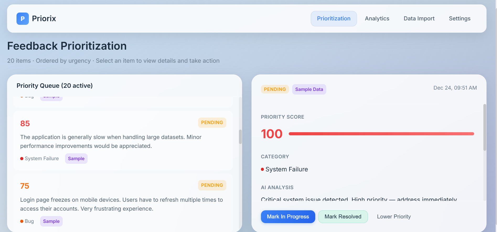
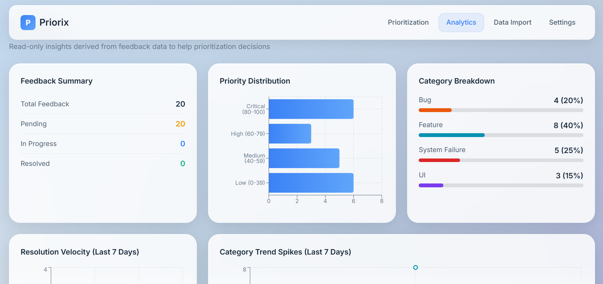
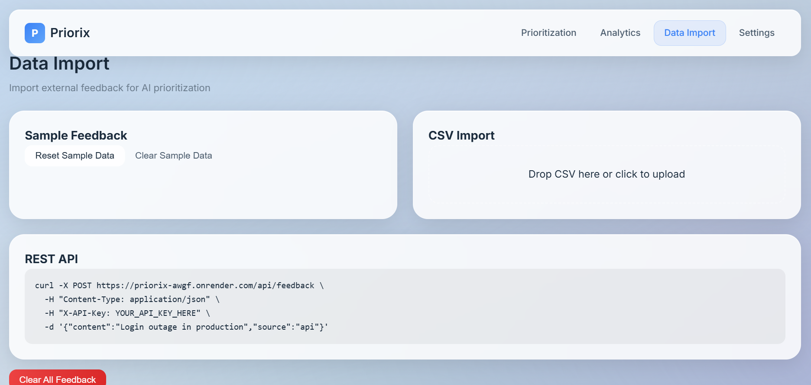

# Priorix

**Prioritize product feedback. Fix what matters first.**

Priorix helps product teams prioritize **software product feedback** — bugs, failures, UX issues, and feature requests — based on urgency and impact.

Live Demo:  
https://priorix-ruddy.vercel.app

---

## What Priorix Is

Priorix is a **product & engineering feedback prioritization system**.

It is designed specifically for **software teams** to:

- Bring together product feedback from an app or SaaS
- Automatically assess urgency and impact
- Assign clear, explainable priority scores (0–100)
- Order issues so teams know what to fix first
- Track progress from pending → resolved
- Analyze product feedback trends over time

This tool exists to answer one question clearly:

> **“What should we fix next?”**

---

## What Priorix Is NOT

Priorix is **not** a generic feedback tool.

It does **not** support:
- ❌ Customer support tickets
- ❌ Sales or marketing feedback
- ❌ HR or internal feedback
- ❌ Surveys or opinion collection
- ❌ Social media sentiment analysis
- ❌ Monitoring or uptime dashboards

If feedback is **not about a software product**, it does not belong in Priorix.

---

## Core Features

### Feedback Ingestion (Product Feedback Only)

Priorix does **not** collect feedback itself.  
It ingests feedback from external sources related to your product.

Supported inputs:
- Sample product feedback dataset (for testing)
- CSV import (bugs, issues, feature requests)
- REST API ingestion with API keys

You can:
- Load sample data
- Clear or reset data
- Test the full prioritization flow before deployment

---

### AI Prioritization Engine

Every feedback item is analyzed and assigned:

- **Category**
  - System Failure
  - Bug
  - UI
  - Feature
- **Priority Score** (0–100)
- **Short, plain‑language reason** explaining the score

The engine is deterministic and transparent — no vague AI outputs.

---

### Actionable Workflow

Each feedback item supports real actions:

- Mark In Progress
- Mark Resolved
- Lower Priority

Actions:
- Update state immediately
- Reorder the priority queue
- Are logged in the audit trail

No fake buttons. No external integrations in this version.

---

### Analytics (Decision‑Focused)

Analytics exist to improve prioritization decisions — not to show vanity metrics.

Included insights:
- Resolution velocity over time
- Category trend spikes
- Priority distribution trends

Excluded by design:
- ❌ Pie charts
- ❌ System health metrics
- ❌ Ingestion volume dashboards

---

## Screenshots

### Feedback Prioritization


### Analytics


### Data Import


---

## Tech Stack

**Frontend**
- React (Vite)

**Backend**
- Node.js
- Express
- SQLite

**Deployment**
- Frontend: Vercel
- Backend: Render

---

## Local Development

Clone the repository:

```bash
git clone https://github.com/your-username/priorix.git
cd priorix
```

Install frontend dependencies and start dev server:

```bash
npm install
npm run dev
```

Start backend server:

```bash
cd server
npm install
node index.js
```

Frontend runs at:
http://localhost:5173

Backend API runs at:
http://localhost:3001

---

## API Example

```bash
curl -X POST https://priorix-awgf.onrender.com/api/feedback \
  -H "Content-Type: application/json" \
  -H "X-API-Key: YOUR_API_KEY" \
  -d '{"content":"Login outage in production","source":"api"}'
```

---

## License

MIT

---

Built by **Rahul Walawalkar**
